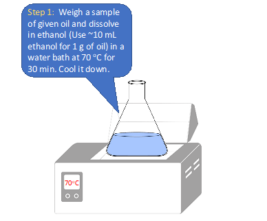
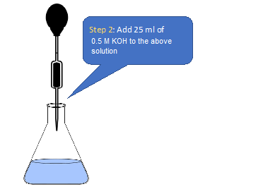
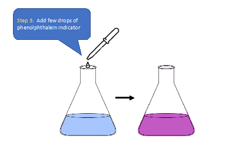
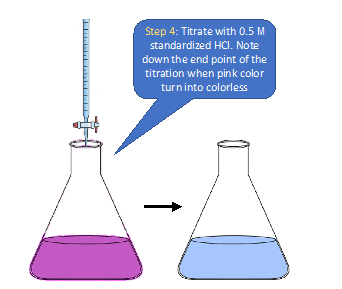
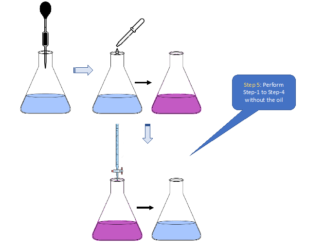
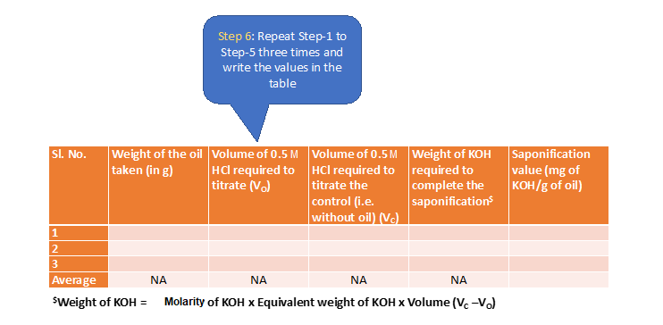
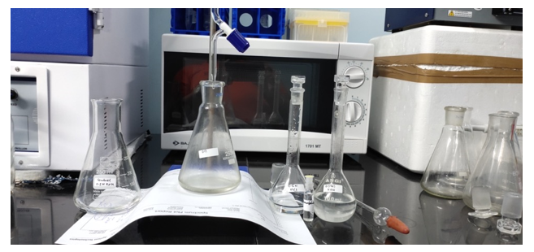
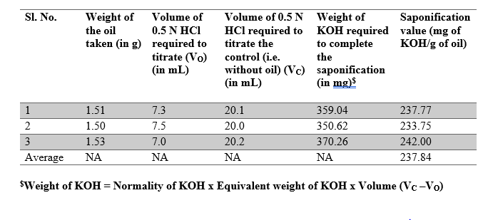
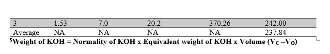

Materials & Reagents Required: 
1)	Fat/oil [e.g. coconut oil, sunflower oil] 
2)	Conical flask (100 mL) 
3)	Weighing balance 
4)	Dropper 
5)	Water bath 
6)	Glass pipette (25 mL) 
7)	Burette (50 mL)
8)	Ethanol (95%) 
9)	Potassium hydroxide [~0.5 N] in ethanol
10)	Hydrochloric acid (standardized and adjusted to 0.5 N)
11)	Phenolphthalein indicator  
<b>Procedure in laboratory (diagram)<b>  
  
  
  
  
  
  
  
  
 
